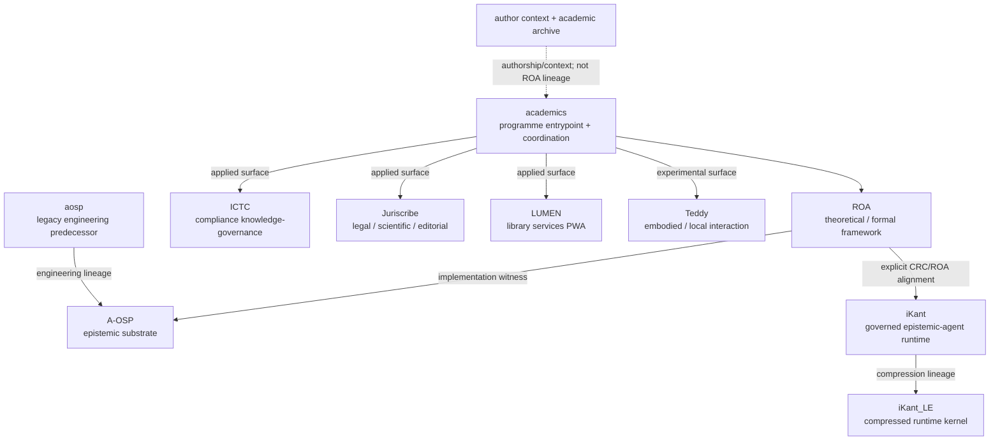
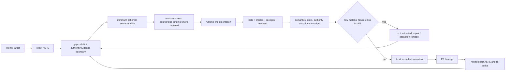
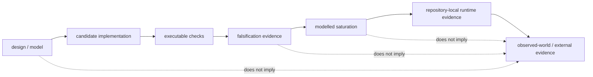

[](https://github.com/Luke883i/academics)
[](https://github.com/Luke883i/academics#repository-map)

<!-- roa-programme-header:v1 hub=Luke883i/academics framework=Luke883i/ROA role=PROGRAMME_HUB -->

# ROA Research Programme

**Computational Epistemics, Semantic Architectures & Governable AI Systems**

`academics` is the public entrypoint and coordination hub for the ROA Research Programme. ROA is the theoretical anchor; the surrounding repositories implement, align with, compress, apply, stress or historically precede parts of the programme without becoming proof of the theory.

## At a glance: what, why, how

| Question | Short answer |
|---|---|
| **What is this?** | A coordinated research programme on computational epistemics and governable AI systems. `academics` is its map and programme hub; [`ROA`](https://github.com/Luke883i/ROA) is its theoretical anchor; the constellation contains distinct engineering, agent, applied and experimental surfaces. |
| **Why does it exist?** | To make AI-assisted knowledge and action reconstructable without silently turning representation into reality, model output into evidence, evidence into authority, decision into execution, or execution into observed-world truth. |
| **How does it evolve?** | Repositories repeatedly derive the exact AS-IS, identify gap/debt and authority boundaries, implement a minimum semantic slice, bind the candidate to an exact revision and - where required - exact Git blob/content digests, execute repository-local oracles, falsify the declared boundary through semantic/state/authority mutations, require an additional no-novelty tail for bounded saturation, then merge and re-derive the new AS-IS. |
| **What is it not?** | Programme membership is not scientific proof or production readiness; modelled saturation is not runtime, physical or external validation; the academic archive is the author's record, not ROA lineage; this hub does not override repository-local authority. |

## Research question

> How can AI systems compute, represent, persist and govern semantic and epistemic state within declared horizons while keeping evidence, inference, authority, decision, execution and observed-world truth distinguishable and reconstructable?

## Programme architecture



The programme is deliberately federated. ROA is not the programme itself, A-OSP is not the theory, iKant is not the substrate, and applied surfaces do not become formal derivations merely by being members of the same research programme.

## Repository map

| Repository | Programme role | Relation |
|---|---|---|
| [`academics`](https://github.com/Luke883i/academics) | Programme entrypoint and coordination hub | Identity, topology and shared claim boundaries |
| [`ROA`](https://github.com/Luke883i/ROA) | Theoretical / formal framework | Theoretical anchor |
| [`A-OSP`](https://github.com/Luke883i/aosp1) | Epistemic substrate | Explicit implementation witness |
| [`iKant`](https://github.com/Luke883i/ikant) | Governed epistemic-agent runtime | Explicit CRC/ROA alignment |
| [`iKant_LE`](https://github.com/Luke883i/iKant_LE) | Compressed constitutional runtime kernel | Compression lineage from iKant; programme component |
| [`ICTC`](https://github.com/Luke883i/ictc) | Compliance knowledge-governance system | Applied programme surface |
| [`Juriscribe`](https://github.com/Luke883i/juriscribe) | Legal/scientific/editorial research system | Applied programme surface |
| [`LUMEN`](https://github.com/Luke883i/lumen) | Library-services web application for students, faculty and librarians | Applied programme surface; local catalogue, optional Koha/OIDC and PWA, not a ROA implementation witness |
| [`Teddy`](https://github.com/Luke883i/teddy) | Embodied/local interaction experiment | Experimental programme surface |
| [`aosp`](https://github.com/Luke883i/aosp) | Historical A-OSP engineering repository | Engineering predecessor to A-OSP |

LUMEN is classified as an **applied library-services surface**, not as a theoretical derivation, a CRC/ROA conformance implementation or evidence that its Koha integration, enterprise ILS capacity or live Render deployment have been certified. Its local contracts and release evidence remain authoritative in the LUMEN repository.

The canonical machine-readable registry is [`PROGRAMME.json`](PROGRAMME.json). Repository-local contracts and evidence remain authoritative for each member's current implementation, runtime, release and governance state.

## Shared epistemic boundary

Across the programme, repository-specific implementations preserve variants of one anti-laundering discipline:

```text
representation      != reality
model output        != evidence
evidence            != permission
permission          != decision
decision            != execution
execution           != observed-world truth
receipt              != external validation
implementation       != scientific proof
modelled saturation != runtime / physical / external proof
```

These are claim boundaries, not slogans: crossing from one layer to another requires whatever additional evidence or authority the repository-local contract declares.

## Development method: bounded semantic slices

A recurring engineering pattern across ROA-associated repositories is development by bounded semantic slices rather than undifferentiated feature accumulation.



A **minimum semantic slice** is the smallest coherent change that closes or contains a demonstrated semantic, authority, evidence, runtime or governance gap while minimizing unrelated surface expansion. The next slice is re-derived from canonical state after each result; a previous roadmap is a falsifiable hypothesis, not permanent authority.

Where the repository's evidence model requires source identity, the candidate is bound to an exact revision and Git blob or content digest. Blob binding proves which bytes the evidence concerns; it does not by itself prove that those bytes are correct.

Mutation campaigns target the declared contract: semantic distinctions, state transitions, authorization relaxations, evidence paths, governance boundaries, failure handling or combinations of these. Scale is risk-adjusted and repository-local. Some programme components use governed ladders such as `1k -> 100k -> 1M -> 10M`, but a large count is never sufficient by itself.

### Saturation by no-novelty

After the primary campaign has exercised the known modeled fault space, an additional independent tail asks whether a **new material failure class or signature** still appears.

```text
known modeled classes exercised
            |
            v
additional independent tail
            |
            v
new material class/signature?
        /             \
      yes              no
       |                |
       v                v
not saturated     bounded modeled saturation
repair/escalate   for the declared model only
or remodel
```

A new example of an existing equivalence class need not reset saturation. Material novelty is structural: for example a new canonical owner, dependency, supported boundary, failure path, evidence obligation, rollback domain, human gate, root class or signature. If novelty survives the maximum governed campaign, the fault taxonomy or model must be revised; it is not permission to claim saturation.

For transformation/compression work, a second tail may test whether a materially better valid compression remains. In all cases, modeled saturation is bounded evidence about the declared model. It never substitutes for executable, runtime, physical, external or scientific validation required by the claim.

See [`programme/METHOD.md`](programme/METHOD.md) for the compact method contract and representative repository evidence.

## Evidence progression



No programme-level diagram can upgrade a repository-local claim. Evidence progression is valid only where the local contract establishes the bridge.

## Hub authority

`academics` owns programme identity, membership topology, directional cross-repository relations, shared claim boundaries and this programme-level method profile.

It is a map and coordination surface, not a super-runtime. Current runtime, release, implementation, test, evidence and governance state always resolves to the member repository that owns it.

## Author context and academic archive

This repository originally began as an archive of university theses and still preserves those PDFs. They document the author's academic trajectory across applied mathematics/economics, audit and control, cybersecurity, and philosophy of AI and information.

The historical directory name [`academic-lineage/`](academic-lineage/) is retained to avoid breaking existing Git history and links. It must not be read as lineage of the ROA Research Programme. The authoritative author/archive metadata is separated into [`AUTHOR.json`](AUTHOR.json); the programme registry no longer treats the theses as programme lineage.

This separation is intentional: shared authorship, chronology or professional context can explain provenance and perspective, but they do not create scientific derivation or validation.

## Semantic falsification of this hub

The refactoring of this entrypoint is accompanied by a deterministic **synthetic semantic-access falsification**, not an empirical user study.

The harness in [`scripts/falsify_hub_semantics.py`](scripts/falsify_hub_semantics.py) exercises 100,000 heterogeneous hypothetical visitor profiles against the hub's `what / why / how` contract, then runs an additional no-novelty tail and semantic ablation mutants. The receipt is committed in [`evidence/hub-semantic-falsification-v1.json`](evidence/hub-semantic-falsification-v1.json) and is bound to the exact candidate Git blobs.

Its claim is intentionally narrow: the information architecture survives the declared synthetic comprehension model and its mutations. It does not prove how real visitors will understand the repository.
